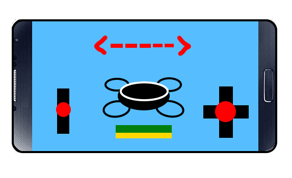
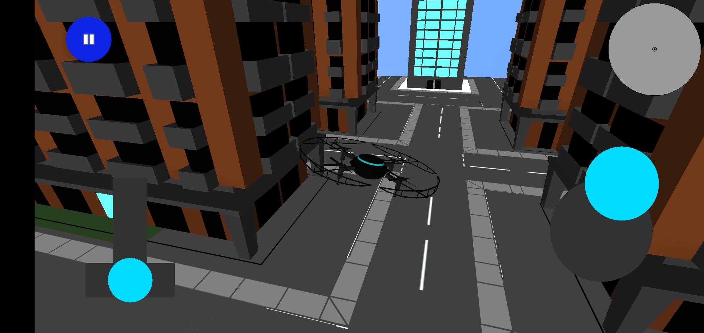

# Interface Design
Requirements of Interface Design:
- Intuitive (1.1)
- Responsive (1.2)
- Accessible (1.3)
- Adaptable (1.4)

The interface design was a product of usability testing results from the **Deployment Testing** and the information from the initial meetings with the clients. 

Intial plans were drawn up of the interface designs during the ealier stages of development, ressembling:
<!-- Picture of UI Design drawing -->

However, subsequent meetings with the client and feedback from their play-test meetings led to the decision to change the layout to better ressemble the drone controller used in the outreach program (run by the client). Resulting in the new user interface we have kept to this date.
<!-- Picture of current user interface -->

Subsequent changes to the interface were a result of additional gameplay features being added into the game (i.e. mini-maps, fuel gauges, pause menues). All changes were tested and approved by the participants during the play-test meetings in which they featured.