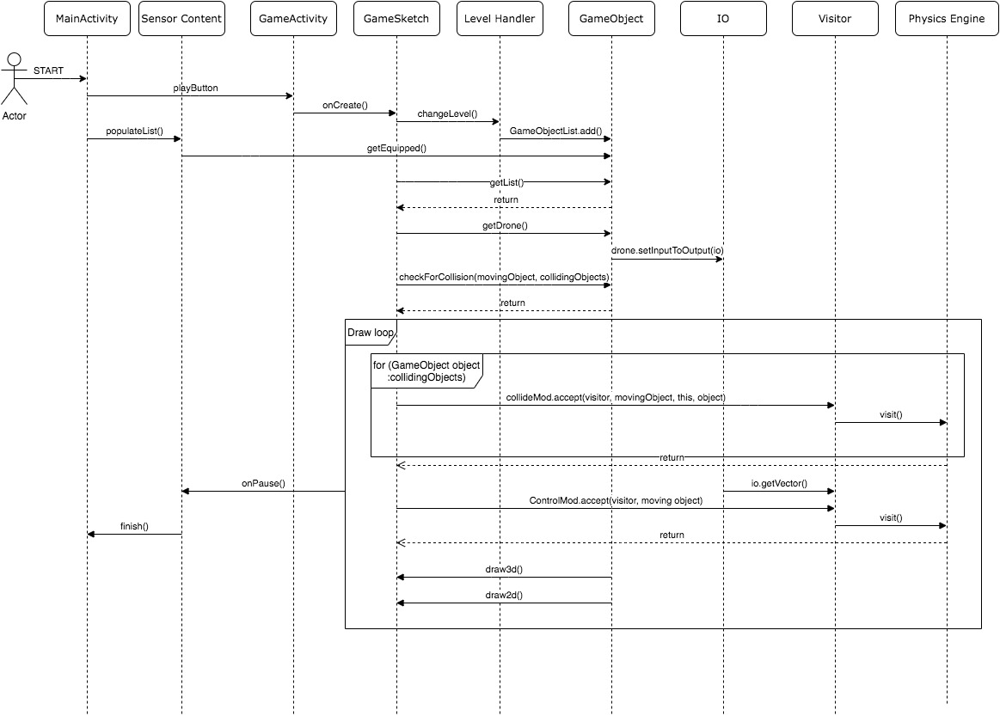

# Dynamic UML

The motivations behind the Dynamic UML were to demonstrate a core aspect of any game system, the draw loop. This system is particularly key to our system as it housed our handling of interactions on a per frame basis, as well as creatively render all the objects in the game that require rendering - doubling as a game loop as well as a draw loop.

The diagram illustrates the basic flow from a 'curious student' stakeholder in terms of getting to the hybrid draw loop. It depicts the flow of how a typical user would initiate a level from `Level Handler`; equipped sensors from `Sensor Content`; `GameObjects` relate to the level and systems like `IO` and its interactions with visitor pattern and `Physics Engine`.

Encapsulated in the `Draw loop`, we have the various gamplay interactions which drive the events in the game. This spans the visitor patterns concerning the `CollideMod` and `ControlMod` visitors. After formulating a list of objects which collide with the drone, we use the `CollideMod` in order to `visit()` each `Game Object` currently interacting with the drone. This was our way of handling all the different interactions with the many different types of `Game Objects` we have in a scalable manner. We demonstrate `ControlMod`'s use of the IO class to retrieve the input vectors (from the user controls) to visit the `Physics Engine` with to process the new position of the drone (taking collisions into account).

With regards to the rendering the various objects we have in the game, `draw3D()` and `draw2D()` methods were given to each `Game Object`. This made it much more scalable to implement rendering conditions for each kind of `Game Object`. All of  whom get called in the main `Draw loop` residing in the `GameSketch` class.