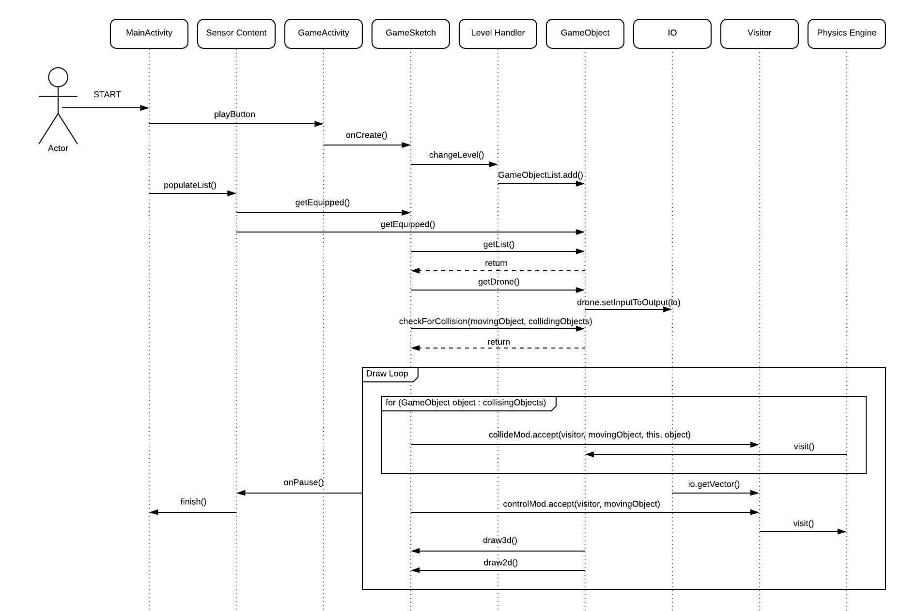
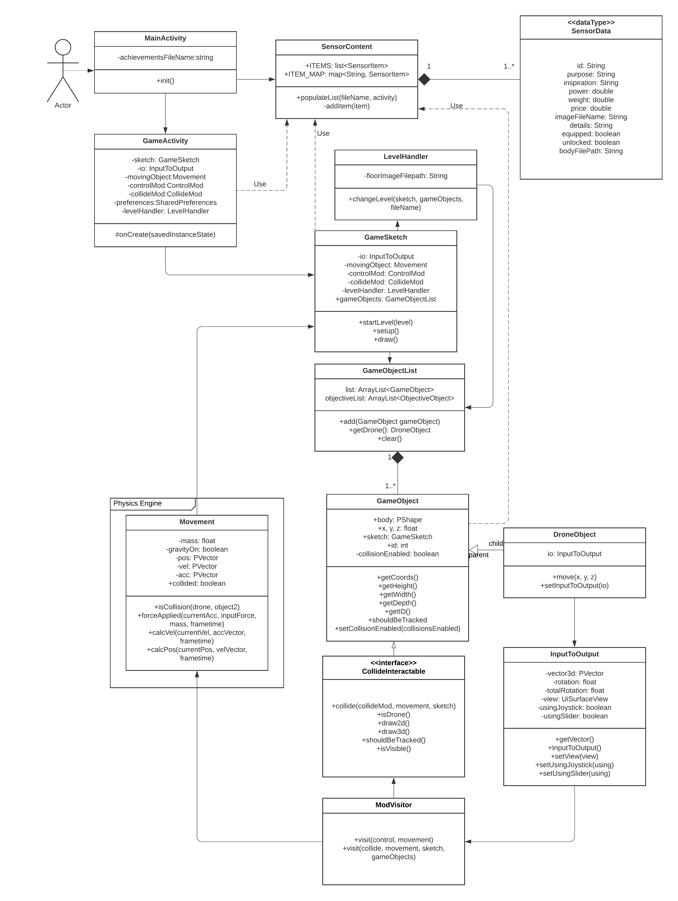

# OO Design & UML

## Dynamic UML

The motivations behind the Dynamic UML were to demonstrate a core aspect of any game system, the `Draw loop`. This system is particularly key to our system as it housed our handling of interactions on a per frame basis, as well as creatively render all the objects in the game that require rendering - doubling as a game loop as well as a rendering loop.

The diagram illustrates the basic flow from a 'curious student' stakeholder in terms of getting to the hybrid draw loop - through the various systems of the game.

Encapsulated in the `Draw loop`, we have the various gameplay interactions which drive the events in the game. This spans the visitor patterns concerning the `CollideMod` and `ControlMod` visitors. After formulating a list of objects which collide with the drone, we use the `CollideMod` in order to `visit()` each colliding `Game Object` and apply its specific interaction to the game. This was our way of handling all the different interactions with the many different types of `Game Objects` we have in a scalable manner. We demonstrate `ControlMod`'s use of the IO class to retrieve the input vectors (from the user controls) to visit the `Physics Engine` with and process the new position of the drone (taking collisions into account).

With regards to the rendering the various objects we have in the game, `draw3D()` and `draw2D()` methods were given to each `Game Object`. This made it much more scalable to implement rendering conditions for each kind of `Game Object`. All of  whom get called in the main `Draw loop` residing in the `GameSketch` class. This taught us how to fully utilise design patterns and OO concepts like interfaces to make complex systems like *'object interactions'* scalable.

## Static UML
</style>

Our static diagram was designed to be more broad than the dynamic diagram as we wanted to represent how our systems are interconnected throughout the whole app. Our app has fairly complex interactions that would be lost if we only showcased a smaller subsystem. We chose to use the visitor pattern as it provided a clear way to let our objects interact with each other. As there are multiple different types of `GameObject`, it seemed sensible to have them visit the `Physics Engine` and then allow that to manage the different collisions, etc. that would then take place.

It is also worth noting that `GameSketch` is represented centrally on our diagram. It is one of the most integral parts of our app; it uses and connects to the other key classes and handles the rendering functions and gameplay features as part of an overall *“game loop”*, which are vital to our game being playable. However, implementing our app in this way did raise challenges. We had issues making sure that the `GameObjects` interact as intended with the sketch, especially when they also needed to use data from the `IO` or the `Physics Engine` directly.  In order to solve this, we developed the `Collide Interactable` to allow any `GameObject` to be visited by our visitor pattern. This taught us the importance of designing class structure and hierarchies fully before we start implementing any functionality into our project.