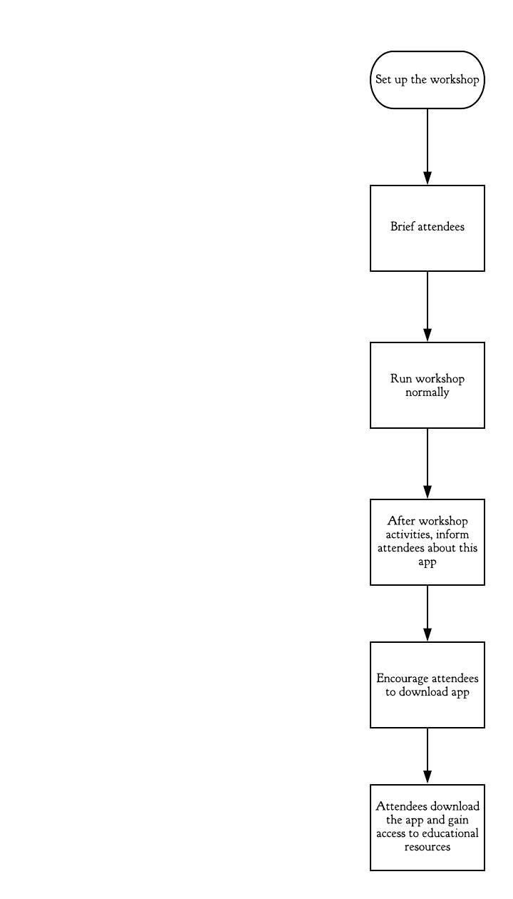

# Overview
<![endif]-->

The client is a group of PhD students that conduct research on the flight behaviour of the urban gulls in Bristol (e.g. how they utilise thermal air currents to conserve energy, how their behaviour differs from gulls living in a rural area, etc.). They use this research, as well as information about the natural sensory organs of other animals, to find ways to maximise the potential of drones to solve problems and contribute to society.

In addition to this research, the PhD students run a SCEEM Outreach workshop that is related to the research they are conducting on bio-inspired flight, to engage them with STEM. Their program consists of a workshop, where attendees are given a problem and asked to solve it using drones. Attendees are given a “budget” that they can use to buy “bio-sensors” (sensors inspired by natural sensory organs of animals) for their drones that may be useful to solving the problem (e.g. echolocation for navigating dark tunnels). They are then asked to manoeuvre a real drone around a physical obstacle course.

The PhD students have requested for a platform similar to the workshop. Though the solution we have presented will also be entertaining to the users, the domain of the project is mainly education; the app will focus on general orienteering of the workshop attendees. The problem that the project will solve is the continuous engagement of attendees after the workshop has ended, to keep them inspired to pursue a career in STEM. As such, the project is not meant to serve as a replacement to the workshop, but rather as something for the attendees to take home and keep them engaged with STEM.

Our proposed solution was to design and create a mobile (Android-based) 3D game, to replicate the challenges that are given to the participants of the workshop. As with the original workshop activity, these challenges will consist of an assault course of problems, as well as a customization system where they will consider the different “bio-sensors” they put on their drones.

# Requirements:
## Core user stories and flow steps:

Out of the user stories above, the ones we will choose to focus on are for the **curious student** and the **PhD students running the workshop**.

## The curious student:

*As a curious student, I want the game to be engaging, informative and representative of real-world scenarios. I would like this so that I can further look into the subjects and be more informed._*

Basic flow:

Alternative play flow:

While this would not necessarily help the student achieve their initial goals of looking further into the subject of the workshop, it could still lead to the student gaining an interest in drones and/or programming in general, which would push them towards STEM.

## PhD students running the workshop

_As a PhD student who runs the workshop, I would want this game to be engaging, inspiring and somewhat informative. I would like this so that the attendees can remember the workshop fondly and may wish to share their experience with other students (via the game)._

Basic flow:

An alternative flow would be to inform the attendees during a break in their workshop.

As for exceptional flows, the app will be Android-based, so attendees will be unable to install it on iOS, for example. However, this is not an issue which we can resolve, due to being locked to creating our app for Android by the project requirements.

Our main goal is to fulfil the client’s request of increasing the attendees’ engagement with STEM. As such, we will base our requirements mainly around the user story of the **curious student**, as they are the attendee that is most likely to benefit from such a platform.

## Functional Requirements

**GAME-1** The game must be optimized to run  at a constant framerate of at least 30 FPS to ensure a smooth gameplay experience, even with 3D assets and the (relatively) limited hardware of a smartphone.

**GAME-2** The core game features will function normally offline. This is to ensure that the user is able to use the app at any time.

**GAME-3** The user interface must have a control scheme that is considered easy to learn by at least 7 out of 10 play-testers.

**GAME-3.1** The initial design of the user interface will use the same control scheme as the drones in the workshop, to allow participants to learn the controls quickly.

**GAME-3.2** The requirement **GAME-3** takes priority over **GAME-3.1**.

**GAME-4** Collision detection will happen before applying player control during each iteration of the game loop, to ensure that the player does not move when it isn’t supposed to (i.e. if the player is trying to phase through a building).

**INFO-1** The application will include a page with scientifically accurate resources related to the client’s research of bio-inspired flight and sensors, to further the client’s goals of encouraging the user to pursue an education in STEM.

**INFO-1.1** The main resources related to this research must be accessible offline to allow the user to read through them at any time, at their own pace.

**INFO-2** If the game has a loading screen, the application will also include facts related to the client’s research on the loading screen, to allow the user to learn during gameplay without being overly intrusive.

## Non-functional Requirements

**APP-0** The size of the app’s APK file **must NOT exceed 50MB**, to comply with the Google Play maximum APK file size limit on all devices. (Some versions of Android allow for APK files of up to 100MB, but we want the app to be accessible to as many people as possible)

**APP-1** The game must be suitable for the PEGI 3 rating, to allow attendees of all ages to benefit from the app.

**GAME-5** The different problems presented in the game must mirror the problems in the workshop activities, to supplement the client’s existing workshop.

**GAME-5.1** The development team will ask the client for advice if any additional scenarios are to be added to the game, to ensure that a sense of realism is preserved.

**SEC-1** If a login system is implemented, user accounts must be secured with a password of min. length 8, containing at least one uppercase letter, one lowercase letter, and a number. This is to ensure a reasonable level of security on the user’s end.

**SEC-1.1** Any passwords stored this way must be stored in its database in salted hash form, to ensure a reasonable level of server-side security.

**SEC-2** The app must NOT allow the user to store sensitive information (i.e. address, health conditions, etc.), as the app is intended to be used by people of all ages (see **AGE-1**), including children as young as 6 years old, who likely do not understand the implications of sharing such data.
