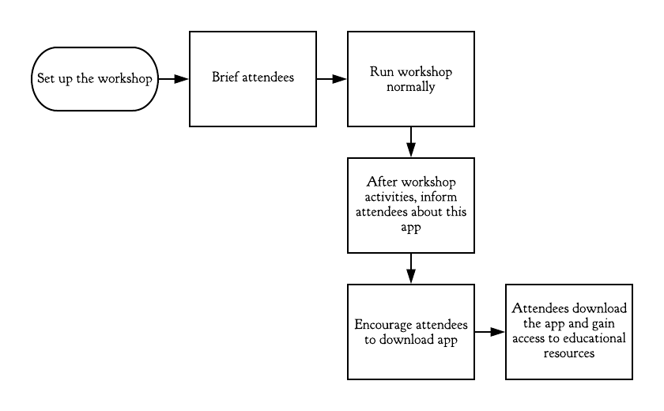
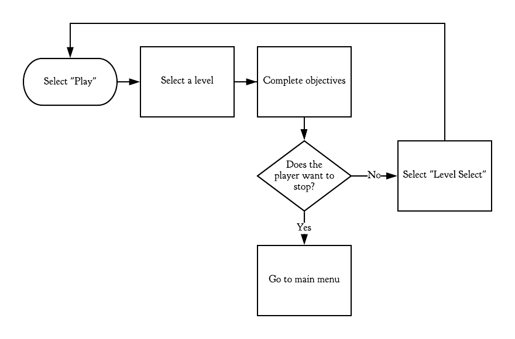
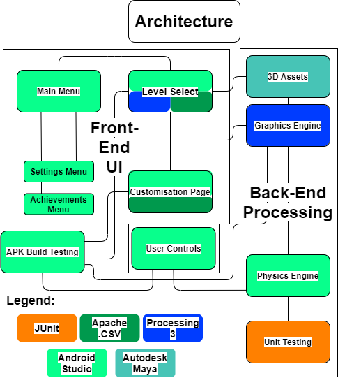

# Overview
**The client:**
*	A group of PhD students at the Bioinspired Flight Lab in the University of Bristol conducting research on the flight behaviour of urban gulls in Bristol
    -	Research includes how gulls utilise thermal air currents to conserve energy, how their behaviour differs from gulls living in a rural area, etc.
    -	The research is used to find ways to maximise the potential of drones to solve problems and contribute to society
*	The students run a SCEEM Outreach workshop related to the research
    -	The purpose of the workshop is to engage attendees with STEM
    -	Attendees are given a problem and asked to solve it using drones, using a budget system to purchase bio-sensors (sensors inspired by natural sensory organs of animals) that may be useful for solving the problem
    -	Attendees then navigate a real drone around a physical obstacle course

**The request:**
*	A platform similar their workshop to keep attendees engaged with STEM afterwards
*	The main domain of the product is education, though the solution is also intended to be entertaining to users
*	The purpose of the product is not an outright replacement of the workshop, but to be something the attendees can take home

**Our solution:**
*	A mobile (Android-based) 3D game intended to replicate the challenges given to the participants of the workshop
*	The challenges will consist of problems in the original workshop, divided into several levels
    -	Certain levels may be timed to simulate time-sensitive problems
*	A customization system will also be available outside of gameplay
    -	Different bio-sensors can be equipped on the drone
    -	Each bio-sensor adds some functionality to either the UI (i.e. minimap) or the drone itself (i.e. the ability to pick up more than one object)
    -	Bio-sensors will also contain educational flavour text about the animal that inspired it

# Requirements:
## Stakeholders
### Workshop Attendees
These are the people who attend the workshops. They are likely to be students from secondary schools and colleges. They can be split into three types of student:
- The **apathetic student.** This student is only attending the workshop out of obligation. They are likely to be part of a school group and would not otherwise have chosen to be there. Primarily, they are in the workshop because they wish to play with and use the drones. They do not necessarily have any interest in STEM and aren’t likely to have much knowledge in the field. This is likely to be due to a lack of exposure to the field, and any chances that they may have had before having not engaged them.
- The **curious student.** This student has more of a general interest in both their education and their schooling. They may possibly already have an interest in STEM fields and could have some basic insight into what the workshop could entail. They have chosen to attend this workshop in order to gain experience and as an opportunity to gain more knowledge in these STEM areas. This student will be interested in more than just having fun flying drones and will hopefully be receptive to the research information that the workshop provides.
- The **driven student.** This student is likely to be exceedingly interested in STEM fields and already have a fair bit of background knowledge in the subject. They are also likely to already be considering their future prospects and what they would like to do in life. Out of these three defined types of students, the driven students are the ones that would be most enthusiastic in attending the workshop. They wish to prepare themselves and to get an insight into what their higher education could resemble (specifically with regards to a possible future in STEM). Like with the curious student, the driven student will also wish to expand their knowledge in the subjects covered in the workshop.
### Workshop Ambassadors
The people who run the workshop and guide the students through the activities. This includes our clients, and the other people that they have enlisted to assist in the running of the workshops. There are two main groups of workshop ambassadors:
- **PhD students who run the workshop (our clients).** Our clients are incredibly passionate about their work and their research. They are proud of what they have researched and wish to share it with other people through the medium of their outreach workshops. They wish to get the attendees excited and engaged in the subject of bio-inspired flight, and through this they look to inspire further engagement into the fields of STEM. They also strive to make sure that their workshop is entertaining and informative (in terms of data from their research) at the same time.
- **The other ambassadors who run the workshop.** These people are helping out with the workshops and making sure that the activities run smoothly for the students to take part in. With more relation to the app which we are creating, these ambassadors may be the ones helping to install it onto the students’ phones. They may also teach them how to use the app and play the game.
### Project Team
These are the people who are involved in the project but are unlikely to use the product once it is complete. There are three different groups here as well:
- **Project Managers.** Daniel Schien and Simon Lock are managing this project. They are here to assist us and to evaluate both our product and our performance at the end of the academic year.
- **Project Mentor.** Our mentor is also here to assist us, and to be a readily available contact if we have any issues or need any advice.
- **Project Developers.** We are the project developers. We will be making the design decisions and producing the product.

## User Stories
### Workshop Attendees:
- As an **apathetic student,** I want the game to be enjoyable to play, so that I can be focused on the gameplay and have a good time.
- As an **apathetic student,** I also want the game to be replayable,  in order to stay engaged and have it hold my attention for longer.
- As a **curious student,** I want the game to be engaging, informative and representative of real-world scenarios. I would like this so that I can further look into the subjects and be more informed.
- As a **driven student,** I would want the research information in the app to be easy to get to and to understand so that I can use it to inform my decisions in pursuing a career in STEM.
- As a **driven student,** I would also want the game to be engaging so that I can still enjoy the larger part of the app as well.
### Workshop Ambassadors:
- As a **client,** I want the game to be fun to play so that the workshop attendees stay engaged in our research in bio-inspired flight. I also want the gameplay to be realistic enough so that it portrays real-world scenarios and doesn’t serve to misinform the people playing the game.
- As a **client,** I also want the game to remind the users of our workshops. This is so that they will be encouraged to stay focused on the subject even after the workshops have finished.
- As an **ambassador,** I want the game to be easy to explain to the students so that I do not have to spend too long trying to help the students get to grips with it. This is because I may have to help many students with only a limited amount of time.
- As an **ambassador,** I also do not want the game to overshadow the workshop as the outreach program is meant to demonstrate the research that has been completed and I would want the game to reinforce the workshop experience, not retract from it.
- As an **ambassador,** I finally want the students to be engaged with the game without too much hassle, so that the students are not put off from the app, either from it being too difficult to set up, or from having too steep of a learning curve.
### Project Team:
- As a **project manager,** I want the product to be a success so that the clients are satisfied with the result of our course and so that the project developers receive a good grade that reflects the effort they have made.
- As a **project mentor,** I want the app to be made following proper developmental procedures so that the students I am mentoring are successful in their course and are able to create a good product for their clients.
- As a **project developer,** I want the product to be well made so that it reflects my abilities in app development and more broadly in software product engineering. 
- As a **project developer,** I also want the scope of the product to be reasonable so that I do not feel stressed or overwhelmed with my workload throughout the duration of this course.

## Core user stories and flow steps:

Out of the user stories above, the ones we will choose to focus on are for the **curious student** and the **clients**.

## The curious student:

*As a curious student, I want the game to be engaging, informative and representative of real-world scenarios. I would like this so that I can further look into the subjects and be more informed._*

Basic flow:

Alternative play flow:

While this would not necessarily help the student achieve their initial goals of looking further into the subject of the workshop, it could still lead to the student gaining an interest in drones and/or programming in general, which would push them towards STEM.

## Clients

_As a client, I would want this game to be engaging, inspiring and somewhat informative. I would like this so that the attendees can remember the workshop fondly and may wish to share their experience with other students (via the game)._

Basic flow:

An alternative flow would be to inform the attendees during a break in their workshop.

As for exceptional flows, the app will be Android-based, so attendees will be unable to install it on iOS, for example. However, this is not an issue which we can resolve, due to being locked to creating our app for Android by the project requirements.

Our main goal is to fulfil the client’s request of increasing the attendees’ engagement with STEM. As such, we will base our requirements mainly around the user story of the **curious student**, as they are the attendee that is most likely to benefit from such a platform.

## Functional Requirements

| Code         | Description                                                                                                                                                                                                                           | Overridden by | Status    |
|--------------|---------------------------------------------------------------------------------------------------------------------------------------------------------------------------------------------------------------------------------------|---------------|-----------|
| **GAME-1**   | The game must be optimized to run at a constant framerate of at least 30 FPS to ensure a smooth gameplay experience, even with 3D assets and the (relatively) limited hardware of a smartphone.                                       | N/A           | Fulfilled |
| **GAME-2**   | The core game features will function normally offline. This is to ensure that the user is able to use the app at any time.                                                                                                            | N/A           | Fulfilled |
| **GAME-3**   | The user interface must have a control scheme that is considered easy to learn by at least 7 out of 10 play-testers.                                                                                                                  | N/A           |           |
| **GAME-3.1** | The initial design of the user interface will use the same control scheme as the drones in the workshop, to allow participants to learn the controls quickly.                                                                         | **GAME-3**  |           |
| **GAME-4**   | Collision detection will happen before applying player control during each iteration of the game loop, to ensure that the player does not move when it isn’t supposed to (i.e. if the player is trying to phase through a building).  | N/A           | Fulfilled |
| **INFO-1**   | The application will include a page with scientifically accurate resources related to the client’s research of bio-inspired flight and sensors, to further the client’s goals of encouraging the user to pursue an education in STEM. | N/A           | Fulfilled |
| **INFO-1.1** | The main resources related to this research must be accessible offline to allow the user to read through them at any time, at their own pace.                                                                                         | N/A           | Fulfilled |
| **INFO-2**   | If the game has a loading screen, the application will also include facts related to the client’s research on the loading screen, to allow the user to learn during gameplay without being overly intrusive.                          | N/A           |           |

## Non-functional Requirements

| Code         | Description                                                                                                                                                                                                                                                                                      | Overridden by | Status         |
|--------------|--------------------------------------------------------------------------------------------------------------------------------------------------------------------------------------------------------------------------------------------------------------------------------------------------|---------------|----------------|
| **APP-0**    | The size of the app’s APK file **must NOT exceed 50MB**, to comply with the Google Play maximum APK file size limit on all devices. (Some versions of Android allow for APK files of up to 100MB, but we want the app to be accessible to as many people as possible)                            | N/A           | Fulfilled      |
| **APP-1**    | The game must be suitable for the PEGI 3 rating, to allow attendees of all ages to benefit from the app.                                                                                                                                                                                         | N/A           | Fulfilled      |
| **GAME-5**   | The different problems presented in the game must mirror the problems in the workshop activities, to supplement the client’s existing workshop.                                                                                                                                                  | N/A           | Fulfilled      |
| **GAME-5.1** | The development team will ask the client for advice if any additional scenarios are to be added to the game, to ensure that a sense of realism is preserved.                                                                                                                                     | N/A           |                |
| **SEC-1**    | If a login system is implemented, user accounts must be secured with a password of min. length 8, containing at least one uppercase letter, one lowercase letter, and a number. This is to ensure a reasonable level of security on the user’s end.                                              | N/A           | Not applicable |
| **SEC-1.1**  | Any passwords stored this way must be stored in its database in salted hash form, to ensure a reasonable level of server-side security.                                                                                                                                                          | N/A           | Not applicable |
| **SEC-2**    | The app must NOT allow the user to store sensitive information (i.e. address, health conditions, etc.), as the app is intended to be used by people of all ages (see **AGE-1**), including children as young as 6 years old, who likely do not understand the implications of sharing such data. | N/A           | Fulfilled      |

# Architecture

After deciding on the project requirements, we went about deciding which ones played a significant feature in deciding the architecture of our final product. We grouped them into 3 main groups: technical contraints, project constraints and quality attributes. We settled on these requirements as our **Architectural Drivers:** 
- Technical Constraints (1.x)
  - (1.1) Mobile application
  - (1.2) Offline functionality
  - (1.3) 3D graphics 
- Project Constraints (2.x)
  - (2.1) Java based project
  - (2.1) Due 1st May 2020
- Quality Attributes (3.x)
  - (3.1) High poly 3D models (Lisence Free)
  - (3.2) Playability
    - (3.2.1) Constant high framerate
    - (3.2.2) Clear UI
    - (3.2.3) Interactabilty 
  - (3.3) Concrete fucntionality testing

In order to fulfill these architectural drivers, we employed the following programs:
  - Android Studio
  - Processing 3
  - Maya

Key libraries to the architecture of the project include:
  - Porcessing Core
  - Apache Commons .CSV library
  - JUnit

#### Software
##### Android Studio:

Android Studio fulfilled a large portion of the architectural drivers as a Java based (2.1), mobile application (1.1) development and distribution platform (2.4). Android Studio also provide a plethora of mobile application support (1.1) such as touchscreen functionality libraries and UI tools which allow us to create and operate front end systems (which include our main menu, level select, settings menu)(3.2.2). As well UI tools and libraries, it provides seemless support of both modular (JUnit)(3.3) as well as our graphics engine (1.3).

##### Processing 3

We chose to use Processing 3 as our 3D graphical engine as it was easily integrated into a larger Android application, due to it also being java-based (2.1), making it ideal for mobile development (1.1). Moreover, known for its efficiency, we thought it would be quite good in keeping graphical rendering overheads to a minimum, especially key when designing software to run on smaller, less powerful mobile processors (3.2.1). Processing also provided seamless support for universal 3D model file types (3.1). 

##### Maya

We decided on using a Maya software to create our very own 3D models (3.1) to eliminate the problem of procuring license-free models. Maya is an easy to learn piece of software, allowing the teammembers in charge of developing models to develop quality 3D assets within the time frame of the project (2.2).

#### Libraries

##### Processsing

The Processing Core library provides graphical engine (3.1) fucntionality to java based projects. Importing this allowed us access to all of Processing's functionality to create the 3D rendering loops in the game (1.1). 

##### Apache Commons .CSV

We planned to utilise the universality of .CSV files as a means of efficient level creation and asset arrangements in our game (2.1). This library provided us with the necessary .CSV parsers we would need.

##### JUnit Testing

To accomplish Test Driven Development, we used the JUnit Testing library in order to test independent features of the game (i.e. our Physics Engine) (3.3).

#### Figure 1: Architecture Diagram

Figure 1 shows the different front and back end systems we will be creating. Our main front-end system will be the **Main Menu**, providing links to the **Settings, Achievements, Level Select** and **Customsations** systems (3.2.2). All will utilise the touchscreen navigation libraries present in Android Studios to enable user interaction (1.1, 3.2). 

User decisiosn in **Level Select** and **Customisations** will interact the various CSV parsers we implemented (using Apache .CSV) in order to determin the state of the loaded game; which in turn will dictate the **3D Models** used by the **Graphics Engine** to display the playable level(3.1, 3.2.3). 

**User Controls** is in its own box as it is a unique user interaction, only working in parallel with game rendering. An Android UI is overlayed on top of the game render to register user controls, passing into the **Physics Engine** to be processed in the back-end. 

The **Physics Engine** uses the inputs from the **User Control** overlay in order to calculate the state of the game every frame through a series of mathematical operations which calculate things like position, acceleration and the presence of collisions/ interactions (3.2.3).

# OO Design & UML

# Development Testing

Consistent with Test Driven Development, we decided on testing strategies for the testable systems in our architecture diagram. 
These testing frameworks were decided on:

- **Front End UI** - APK Build test
- **Graphics Rendering** - Visual Testing
- **.CSV Level Handler** - APK Build Testing
- **Physics Engine** - JUnit Testing

#### APK Build Testing
Android studio provided an **APK Build** feature which allowed us to test things like functionality of certain *non-numeric* features, as well as robustness of integrated systems. This would compile the project state and export it as a testable APK which installed onto a connected mobile device (a terminal would display system messages describing the events occuring and processes running during application usage). This made more sense for complex integrated systems like the **.CSV Level Handler** and **Front End UI**. We were also able to test the usability factor of the application (which is importatant when a game is concerned).

#### Visual Testing
Earlier on in development, where the 3D assets were not ready, we used visual placeholders in order to ensure the correctness of the renderer during the **APK Build Tests**. Through this, we were able to test that objects created by our graphical engine would be rendered in the correct position, orientation and size.

#### JUnit Testing
Testing the correctness of methods in both normal and edge through the JUnit Testing framework proved the robustness of systems and methods. In back-end systems like our **Physics Engine**, which was implemented with independently functioning methods, it was the only system that made sense to use this kind of testing.
Below is an example of some **JUnit** test cases used to test the **Physics Engine**:

### **Testing Table Sample:**
|Test              | Testing Condition | Pass/Fail    |
|:-------------    | ----------------- |-------------:|
| @Test forceAppliedTest | `//Set the comparison parameters` `expectedAcc = (240f, 150f, 0f);` `//Set context` `result = forceApplied(initAcc, inputForce, movement.getMass(), movement.frametime);` `assertEquals(expectedAcc, result, delta);`| **Pass** |
| @Test CalcVelTest | `//Set Comparison Parameters` `inputAcc = (240f, 150f,0f)` `expectedVel = (8f, 5f, -6f);` `//Set Context` `result = movement.calcVel(movement.getVel(), inputAcc, movement.frametime);` `assertEquals(expectedVel, result, delta);` | **Pass**|
| @Test CollisionTrueTest| `//Set context` `InitPos = (2543f, 3500f,500f );` `movement.setPos(initPos);` `movement.setMovementSize(droneObject);` `obj = ApartmentsObject(4000f, 660f, 4000f, 1, 1, 1);` `movement.isCollision(movement, obj);` `assertTrue(movement.collided);`| **Pass** |
| @Test UpdateMovement Test |`//Comparison parameters` `expectedAcc = (240f, 150f, 0f);` `expectedVel = (6f, 3f, -4f);` `expectedPos = (0.27f, 0.17f, 0f);` `//Set context` `movement.updateMover(expectedAcc, expectedVel, expectedPos, movement);` `assertEquals(expectedAcc, (movement.getAcc()), delta);` `assertEquals(expectedVel, (movement.getVel()), delta);` `assertEquals(expectedPos, (movement.getPos()), delta);` | **Pass** |

# Deployment Testing

### Release Testing Strategy:
|   Phase   | Heuristic  |Test         |Met         |
|:----------|:-----------|:------------|:----------:|
|**Minimum Viable Product (1.x.)**|1.1. Working movement (**Physics Engine**) 1.2. Drone Model (**3D Models**) 1.3. Control System (**User Controls**) 1.4. Menu (**Front-End UI**) 1.5. Test Level(**Graphics Engine**) | 1.1. JUnit Tests Pass 1.2. Drone model present 1.3. Control feedback visible 1.4. Menu navigation possible 1.5. Level with win condition complete| 1.1.**Yes**  1.2.**Yes**  1.3.**Yes**  1.4.**Yes**  1.5.**No** |
|**Beta Release (2.x.)**| 2.1. Collision Detection (**Physics Engine**) 2.2. 3D Building Models (**3D Models**) 2.3. Intuitive Controls (**User Controls**) 2.4. Achievements menu (**Front-End UI**) 2.5. Test Level (**Level Select**)| 2.1. Collision detected with building  2.2. Imported and rendered building.obj  2.3. Controls mimic drone remote  2.4. Achievements page generated via .csv file 2.5. Level with building and win condition |2.1.**Yes**  2.2.**No**  2.3.**Yes**  2.4.**Yes**   2.5.**No**|
|**Final Release (3.x.)**|3.1. Sensor Models (**3D Models**) 3.2. Customisation Menu (**UI**) 3.3. Level Handler (**UI**) 3.4. Environment Interactabels (**Physics Engine**) 3.5. Playble Levels| 3.1. Models present  3.2. Customisation selections playable 3.3. Correct levels loaded from .csv file 3.4. Correct interactions objects 3.5. Levels completeable |3.1.**Yes**    3.2.**Yes**    3.3.**Yes**   3.4.**Yes**  3.5.**No** |

Due to the continous integration we carried out through our project through APK Build Testing, we were very easily able to test high level heuristics (above). The dev team provided a wealth of heuristic feedback from build testing, but we wanted an objective subject to better gauge the quality of each release.

Every release was tested with the clients through arranged play-test meetings. Before each release deadline, a meeting with the client would be arranged to test the current stage of the game according to the heuristics defined in the release testing strategy table. As an example of a user story and aware of the heuristics set out for the current release (decided in the prior meeting), the client made the perfect test user.

#### Method:
Heuristics decided collaboratively between our development team and client would be assigned for a specific release during a meeting. We took these heuristics and planned tests which would prove the heuristics met (shown in **Table 2**). During the play test, the client would be given a device with the game installed onto it and observed as they interacted with the device. Through observations and a questionnaire after the playtest we would mark downt the reseults of the heuristic tests. These results would then go onto influence the decision of the next target heurisitcs for the following release.

# Product Evaluation
Due to the Covid-19 pandemic that is currently affecting us all, we were unable to work with any of the end users of our product. In an effort to still get some feedback on our design choices and the overall app which we have developed, we opted to instead trial our app with our siblings that are of a similar age and demographic to the intended users. However, this understandably yielded a much smaller amount of feedback than we would have liked. We decided that the best approach for this evaluation was through observation. We also asked for any extra comments which they may have had. These can be seen in the table below.

| Comment(s) | Possible solutions | Solvable |
|:---------------|:-----------|:----------:|
|"Turning is too sensitive." "It is hard to hover in place."|The slider to control both rotations and height could be made larger, so that more precision can be gained when it is in use. This will allow for slower turning speeds to be used, and should make it easier to find the correct position to hover the drone.|Yes|
|"The loops turn red too fast." "The loops are too far apart, they don't show up on the minimap until you are close." "The timer ran out too fast."|These are level design issues that we can solve by simply changing the level files.|Yes|
|"I keep getting stuck on the building, I want to slide across the walls instead."|This is a much harder issue to solve as it would require changing a large part of how our physics engine calcuates collisions.|Not without large changes|

# Extra Notes
Due to many factors, including the Covid-19 pandemic, we were unable to completely finish the game to a standard which we are happy with. Due to this, we have offered to continue development in the summer in order to polish and complete the app for our clients. As a result, we will be able to solve many of the issues that have been raised in our product evaluation. Furthermore, we hope to get more feedback from our clients (and potentially more intended end users) in order to make sure that the end result is completed correctly. 

# Source Code
All source can be found on our git repository: 
[Bioinspired Flight Bitbucket Repository](https://bitbucket.org/antoine1201/bio-inspired-flight/)

# Client Documentation
## Licence Documentation
All licence documentation can be found in the LICENCES folder of our git repository (linked above). It is also listed under the "Settings" menu of our app.

## Instruction Manual
.png)
.png)
.png)
.png)